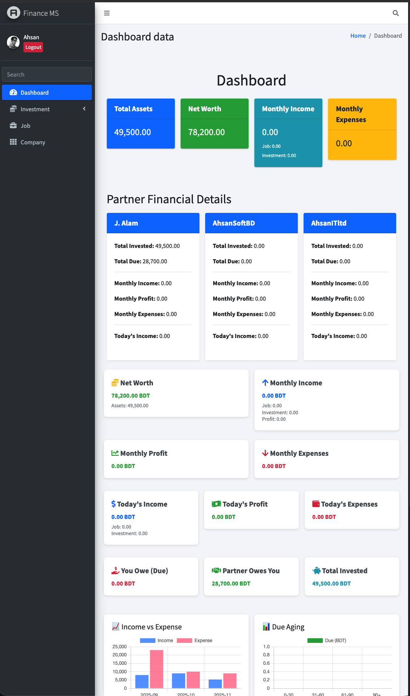
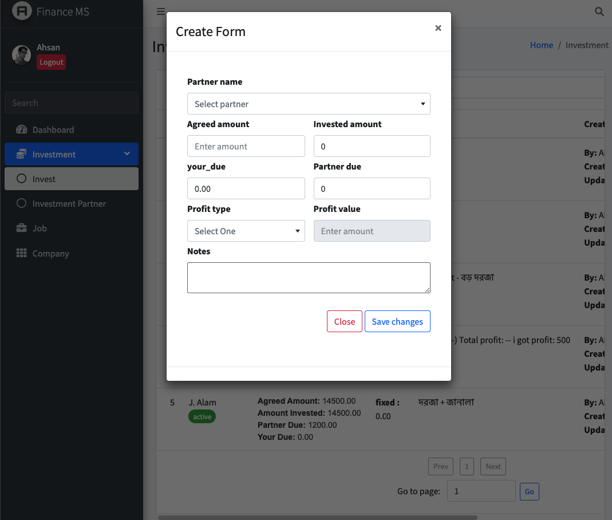

# Laravel Investment & Job Dashboard

A modern **Laravel 10** web application to manage company data, investments, investment partners, and job earnings. It includes both web and API functionality with authentication and authorization.

---

## Table of Contents

- [Features](#features)
- [Screenshots](#screenshots)
- [Installation](#installation)
- [Configuration](#configuration)
- [Usage](#usage)
- [API Endpoints](#api-endpoints)
- [Authentication](#authentication)
- [License](#license)

---

## Features

- User authentication and registration with email verification.
- User profile management (edit, update, delete).
- Dashboard with overview of companies, investments, and job earnings.
- CRUD functionality for:
  - Companies
  - Investments
  - Investment Partners
  - Job Earnings
- RESTful API endpoints secured with **Sanctum**.
- CSRF protection and secure session management.

---

## Screenshots

| Dashboard | Investment Page |
|-----------|----------------|
|  |  |

---

## Installation

1. Clone the repository:

```bash
git clone https://github.com/your-username/laravel-investment-dashboard.git
cd laravel-investment-dashboard
````

2. Install dependencies:

```bash
composer install
npm install
npm run dev
```

3. Copy `.env.example` to `.env` and configure your environment variables:

```bash
cp .env.example .env
php artisan key:generate
```

4. Set up the database:

```bash
php artisan migrate
php artisan db:seed
```

5. Run the development server:

```bash
php artisan serve
```

---

## Configuration

Make sure to configure the following in your `.env` file:

```env
DB_CONNECTION=mysql
DB_HOST=127.0.0.1
DB_PORT=3306
DB_DATABASE=your_database
DB_USERNAME=your_username
DB_PASSWORD=your_password

SANCTUM_STATEFUL_DOMAINS=localhost
```

---

## Usage

* Visit `http://localhost:8000` to access the welcome page.
* Register a new user or log in with an existing account.
* Access dashboard, company, investment, and job earning pages.
* Edit your profile at `/profile`.

---

## API Endpoints

All API endpoints are secured with **Sanctum** authentication.

### User

```
GET /api/user
```

### Company

```
/api-company-data
```

### Investment Partner

```
/api-investment-partner-data
```

### Investment

```
/api-investment-data
```

### Investment Log

```
/api-investment-log-data
```

### Job Earning

```
/api-job-earning-data
```

---

## Authentication

* Laravel Breeze (or Jetstream) is used for authentication.
* Routes for guest users:

  * `register`, `login`, `forgot-password`, `reset-password`
* Routes for authenticated users:

  * `dashboard`, `profile`, `logout`, `verify-email`, `confirm-password`, `update-password`

---

## License

Open project licensed under the MIT License. See the [LICENSE](LICENSE) file for details.


---